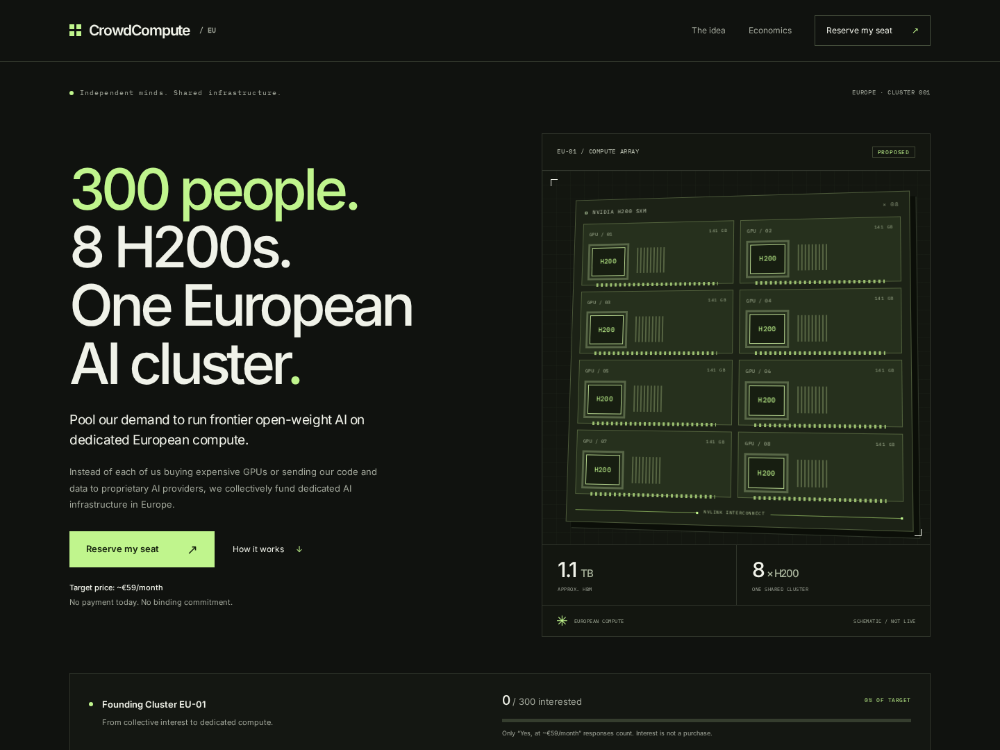

# CrowdCompute / EU-01

**300 people. 8 H200s. One European AI cluster.**

One person renting an 8×H200 node makes little economic sense. A few hundred people sharing one
does. CrowdCompute is a proposal to pool a monthly budget, fund a dedicated node in Europe, and
run a frontier open-weight model on infrastructure whose cost, utilisation and model version are
visible to the people paying for it.

**→ Read the proposal: [`docs/PROPOSAL.md`](docs/PROPOSAL.md)** — the argument, the arithmetic,
and the questions that are still open.

This repository also contains the demand-validation site that tests whether the idea has takers.
It is deployed to Cloudflare Pages and live at [crowdcompute.eu](https://crowdcompute.eu).



## Where this stands

As of 22 September 2026:

|                                       |                        |
| ------------------------------------- | ---------------------- |
| Responses saying "yes, at ~€59/month" | **49** of a 300 target |
| Total responses                       | 61                     |
| Infrastructure contract               | None signed            |
| Money collected                       | None                   |
| Legal entity                          | Not formed             |

Live figures: [`GET /api/stats`](https://crowdcompute.eu/api/stats).

No payments, accounts, GPU ownership or AI inference are implemented or implied. An email plus
Turnstile is an expression of interest — not a verified unique human, and not an enforceable
commitment.

## The short version of the economics

`300 × €59 ≈ €17,700/month` is gross. After VAT, payment processing and ancillary costs, roughly
**€13,288** is actually available for compute — which fits the reserved-tier market rate for
8×H200 in Europe (€11,000–16,000/month), and nothing above it. Below ~300 members the model does
not close at all.

The full derivation, the sensitivity table and the reasons this might fail are in
[`docs/PROPOSAL.md`](docs/PROPOSAL.md).

## What this is not

Not GPU ownership. Not an SLA. Not a guaranteed model. Not unlimited capacity. Not a purchase.
Each of those is expanded in [the proposal](docs/PROPOSAL.md#4-what-this-is-not).

## The site

A static Astro landing page, a reservation form backed by Cloudflare Pages Functions and D1,
Turnstile verification, and live aggregate interest/model-vote statistics.

- Custom dark infrastructure design, self-hosted typography, eight-GPU schematic built in HTML/CSS, responsive layouts and reduced-motion support.
- All proposal sections, transparent target economics, realistic capacity caveats and clearly labelled future access.
- Accessible form, loading/error/empty/success states, copy-to-clipboard sharing and no tracking pixels.
- Server validation, prepared SQL, normalized unique emails and atomic updates protected by a browser receipt.
- Real D1 aggregate statistics. Only `would_pay_59 = 'yes'` contributes to the target. All responses contribute to model votes, including "community decides." Percentages are rounded independently.
- Privacy page, self-hosted fonts, favicon, generated PNG social card, canonical URLs, sitemap, security headers and strict CSP.
- Unit/integration tests against local D1 and Playwright/axe browser checks.

## Documentation

| Document                                       | Contents                                                                     |
| ---------------------------------------------- | ---------------------------------------------------------------------------- |
| [`docs/PROPOSAL.md`](docs/PROPOSAL.md)         | The idea, the economics, the open questions, the go/no-go criteria           |
| [`docs/DEPLOY.md`](docs/DEPLOY.md)             | Project layout, local development, deployment runbook, API behaviour, routes |
| [`docs/VERIFICATION.md`](docs/VERIFICATION.md) | What was tested and how                                                      |

## Quick start

```bash
npm install
cp .env.example .env
cp .dev.vars.example .dev.vars
npm run dev:full    # http://localhost:8788
```

Full setup, Cloudflare configuration and deployment steps: [`docs/DEPLOY.md`](docs/DEPLOY.md).
